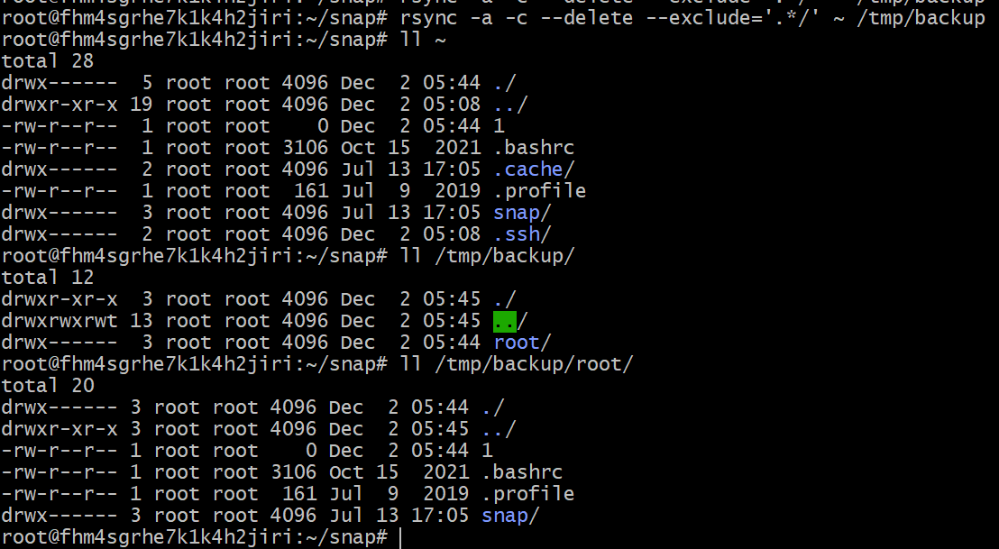
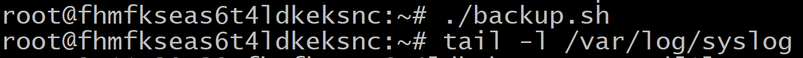
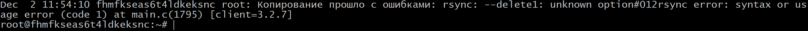
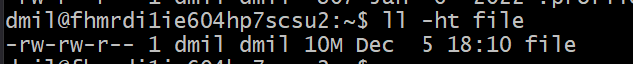
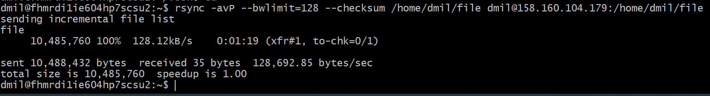
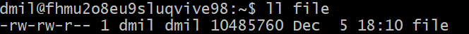

### Задание 1
- Составьте команду rsync, которая позволяет создавать зеркальную копию домашней директории пользователя в директорию `/tmp/backup`
- Необходимо исключить из синхронизации все директории, начинающиеся с точки (скрытые)
- Необходимо сделать так, чтобы rsync подсчитывал хэш-суммы для всех файлов, даже если их время модификации и размер идентичны в источнике и приемнике.
- На проверку направить скриншот с командой и результатом ее выполнения

```
rsync -a -c --delete --exclude='.*/' ~ /tmp/backup
```



### Задание 2
- Написать скрипт и настроить задачу на регулярное резервное копирование домашней директории пользователя с помощью rsync и cron.
- Резервная копия должна быть полностью зеркальной
- Резервная копия должна создаваться раз в день, в системном логе должна появляться запись об успешном или неуспешном выполнении операции
- Резервная копия размещается локально, в директории `/tmp/backup`
- На проверку направить файл crontab и скриншот с результатом работы утилиты.


Подготовил скрипт:
```
rsync -a --delete --exclude='.*/' ~ /tmp/backup 2> errors.txt
if [[ $? -eq 0 ]]; then
    logger "Копирование прошло успешно"
    exit 0
else
    err=$(cat errors.txt);
    logger "Копирование прошло c ошибками: $err "
    exit 1
fi
```

crontab -l:

```
0 0 * * * \root\backup.sh
```


Внес ошибку в скрипт rsync и запустил:




---

## Задания со звёздочкой*
Эти задания дополнительные. Их можно не выполнять. На зачёт это не повлияет. Вы можете их выполнить, если хотите глубже разобраться в материале.

---

### Задание 3*
- Настройте ограничение на используемую пропускную способность rsync до 1 Мбит/c
- Проверьте настройку, синхронизируя большой файл между двумя серверами
- На проверку направьте команду и результат ее выполнения в виде скриншота

Поднял две ВМ:


Создаю файл 10 мб на 1 ВМ:

```
dd if=/dev/random of=/home/dmil/file bs=1M count=10
```


1 Мбит в сек = 1000 кбит в секунду = 1000/8= 125 кБайт в секнду

Настроил вход с вм1 на вм2 по сертификату:

```
ssh-keygen
```
Копирую в буфер обмена:

```
 cat id_rsa.pub
ssh-rsa AAAAB3NzaC1yc2EAAAADAQABAAABgQDJ4PPAe/r4s7neyk1rDpBzdOnkwnlaJMHfln14EfuK/fP5Ryo4KLpKco8AcK7JFRCv/VecdiMODhp6y4m/0GTda4BCMKNcxzhAUD7aPLWNdX9uT19Wf+zeDNr50UeW4qnvJelgHvoUVzcHTeCpuebwIe5QmwgQ/DTvpe+ppTVD8aXRYtLcAfiXDBM0hYwjqMuO1DbE4981L21d1yhTe+KBGORfoYWOfHdKNCctKX823vOZNAQkmF6IvcsDJtMuhA3vxDUNRgCbQ3PVhxGLw4x65TzXPSm6pLmQt18kpi/XuwmvalcUaXN89bIzxnre6QUQXS/KCjAMzdArdbvKEf6jaz9b6POsNo+Hn2C1bL3DVP7LOsHC9xu29UKDeo3uNXSdTUQdJvVeadGgpzM+zf9oG9pfYylXBm4rI3JZuv5XnGPFbCVTDdHAzCRte7T1C+f+J9mw7gby8dfPQA/jJnu+uTgdgvkFXqqtKY7yTt4D3zKhUry8P67pdxUN+QdoET8= dmil@fhmrdi1ie604hp7scsu2
```
Вставляю в файл на другой ВМ:
```
nano authorized_keys
```
проверил можно войти по ssh.

Запуск копирования между серверами:

```
    rsync -avP --bwlimit=128 --checksum /home/dmil/file dmil@158.160.104.179:/home/dmil/file
```


Копирование прошло за 1мин20сек - все ок.

На 2вм файл появился:



### Задание 4*
- Напишите скрипт, который будет производить инкрементное резервное копирование домашней директории пользователя с помощью rsync на другой сервер
- Скрипт должен удалять старые резервные копии (сохранять только последние 5 штук)
- Напишите скрипт управления резервными копиями, в нем можно выбрать резервную копию и данные восстановятся к состоянию на момент создания данной резервной копии.
- На проверку направьте скрипт и скриншоты, демонстрирующие его работу в различных сценариях.


Cначала изучил работу скрипта (чуть подправил) - раскладывает на папки с днями неделями:

```
#!/bin/sh

# This script does personal backups to a rsync backup server. You will end up
# with a 7 day rotating incremental backup. The incrementals will go
# into subdirectories named after the day of the week, and the current
# full backup goes into a directory called "current"

clear

# directory to backup
BDIR=/home/$USER
echo "BDIR=$BDIR"

# excludes file - this contains a wildcard pattern per line of files to exclude
EXCLUDES=$HOME/cron/excludes

# the name of the backup machine
BSERVER=158.160.53.173
echo "BSERVER=$BSERVER"

# your password on the backup server
#export RSYNC_PASSWORD=XXXXXX


########################################################################

BACKUPDIR=`date +%A`
echo "BACKUPDIR=$BACKUPDIR"

OPTS="--force --ignore-errors --delete-excluded --exclude-from=$EXCLUDES --delete --backup --backup-dir=/home/$USER/$USER/$BACKUPDIR -a"

#export PATH=$PATH:/bin:/usr/bin:/usr/local/bin

# the following line clears the last weeks incremental directory
[ -d $HOME/emptydir ] || mkdir $HOME/emptydir
echo "rsync --delete -a $HOME/emptydir/ $USER@$BSERVER:$USER/$BACKUPDIR/"
rsync --delete -a $HOME/emptydir/ $BSERVER:$USER/$BACKUPDIR/
#rmdir $HOME/emptydir

# now the actual transfer
echo "rsync $OPTS $BDIR $USER@$BSERVER:$USER/current"
rsync $OPTS $BDIR $BSERVER:$USER/current
```

освоив работу и получив опыт делаю свой скрипт по задаче:

```
#!/bin/sh

# This script does personal backups to a rsync backup server. You will end up
# with a incremental backup. The incrementals will go
# into subdirectories named as date, and the current
# full backup goes into a directory called "current"

clear

# source directory
BDIR=/home/$USER/
# excludes file - this contains a wildcard pattern per line of files to exclude
EXCLUDES=$HOME/cron/excludes

# destination
# the name of the backup machine
BSERVER=158.160.32.142
ROOTBACKUPDIR="/backups"

########################################################################

BACKUPTIMEDIR=`date +%Y-%m-%d-%H%M%S`
ssh "$USER@$BSERVER" "test -d $ROOTBACKUPDIR/$USER/inc/$BACKUPTIMEDIR/ || mkdir -p $ROOTBACKUPDIR/$USER/inc/$BACKUPTIMEDIR"

ssh "$USER@$BSERVER" "cd $ROOTBACKUPDIR/$USER/inc&&ls -t | tail -n +6 | xargs rm -rf --"

OPTS="--force --ignore-errors --delete-excluded --exclude-from=$EXCLUDES --delete --backup --backup-dir=$ROOTBACKUPDIR/$USER/inc/$BACKUPTIMEDIR ->

#export PATH=$PATH:/bin:/usr/bin:/usr/local/bin

# now the actual transfer
echo "rsync $OPTS $BDIR $BSERVER:$ROOTBACKUPDIR/$USER/current"
rsync $OPTS $BDIR $BSERVER:$ROOTBACKUPDIR/$USER/current
```
Для восстановления данных из бэкапа:


 


